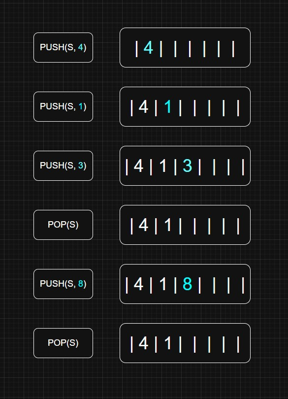
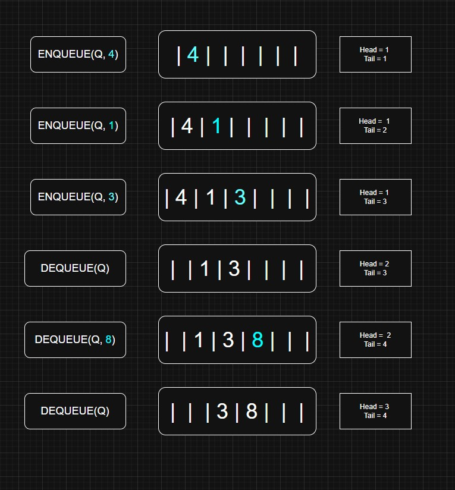

# StacksQueuesLab
CISC 187 Week 6 Lab
## Task 1 
### Illustrate the result of each operation in the sequence using figure 17 as a model, on an empty stack S stored in an array S[1..6]
#### Stacks are LIFO Last In First Out
#### PUSH Inserts element at the end
#### POP Deletes elements from the end
#### (S is the stack we are affecting, # is the Value inserting)



## Task 2
### Illustrate the result of each operation in the sequence using figure 18 as a model, on an initially empty queue Q stored in an array Q[1..6]
#### From Book: FIFO
#### Same Concept (Q is queue, # is inserted element)
#### Enqueue takes place at tail, dequeue is the element at head
#### Order is Q.head, Q.head+1, ....., Q.tail -1



## Task 3 Rewrite ENQUEUE and DEQUEUE to detect underflow and overflow of a queue.

### ENQUEUE Rewrite

Using the Pseudocode template given from our textbook, some basic modification can help us to detect overflow. We want to check for overflow before performing any operation on our queue. Q.head and Q.tail are already tracked, every condition involving overflow is accounted for. Realistically I would combine my two overflow if statements into one, however, for readability I separated them to create clear separate cases for this task. The two conditions described in the book are that overflow will occur in a queue if we attempt to ENQUEUE when:

1) Q.head == Q.tail + 1
2) Both, Q.head == 1 && Q.tail == Q.length

Since the assignment asked for detection, I merely added an error statement in the pseudocode to indicate that action.

Pseudocode of ENQUEUE(Q,x)
```
if Q.head == Q.tail + 1
    error Overflow
else if Q.head == 1 and Q.tail == Q.length
    error Overflow

Q[Q.tail] = x

if Q.tail == Q.length
    Q.tail = 1
else 
    Q.tail = Q.tail + 1
```

### DEQUEUE Rewrite
Underflow of a queue occurs when we attempt to dequeue on an empty queue. The way to detect an empty queue would be to check if Q.head and Q.tail are equal. We would want to add this in to the front of the if statements and declaration of x, as we need to check for underflow before continuing operations.

Pseudocode of DEQUEUE(Q)
```
if Q.head == Q.tail
    error Underflow

x = Q[Q.head]

if Q.head == Q.length
    Q.head = 1
else 
    Q.head = Q.head + 1

return x
```


## Task 4: Write 4 O(1)-time procedures to insert elements into and delete elements from both ends of a deque implemented array

Using D as our Deque and x as our value. Utilizing 1-index basing, just like with the queue pseudocode.

### Insertion at beginning

I tracked basic overflow logic for insertion using the logic defined in the queue task as a basis. D.head == -1 is a way to detect if head is a null/empty value, in which we want to make both head and tail equal to 1 for the first inserted element. If D.head is equal to 1 we cannot move backwards, and thus have to circle back around to our last space which is D.length. D.head = D.head -1 is changing D.head upon inserting this new element, 

ie) we have | | | |1 | 2| 3|,

1 would be the head element, so we want to decrement to insert at the beginning of these values in this case. 
```
if D.head == 1 and D.tail == D.length
    error "Overflow"
if D.head == D.tail + 1
    error "Overflow"

if D.head == -1
    D.head = 1
    D.tail = 1
else if D.head == 1
    D.head = D.length
else
    D.head = D.head - 1

D[D.head] = x
```

### Insertion at end

Same checks for overflow as insertion at the beginning. Rather than moving our head pointer backwards we move the tail forward in end cases. Our indexing checks replaces head with tail, a sort of reverse of operations where tail increments as opposed to head decrementing. If tail is already equal to the length we must circle back to the front to index 1 to make more dynamic structures, a sort of circular loop. Even if tail is the 1st index and head the 2nd, unraveling them will still show the correct order.
```
if D.head == 1 and D.tail == D.length
    error "Overflow"
if D.head == D.tail + 1
    error "Overflow"

if D.head == -1
    D.head = 1
    D.tail = 1
else if D.tail == D.length
    D.tail = 1
else
    D.tail  = D.tail + 1

D[D.tail] = x
```
### Deletion at beginning

D.head == -1, the deque is empty, removing would cause underflow in this case. If D.head == D.tail there is only one element, if we delete it we have an empty deque, and as such we have to "reset" it by marking tail and head as empty again, relating to our checks in the other functions on whether the deque is empty. If we do remove, we want the new head to be one greater since the current head is now empty.
```
if D.head == -1
    error Underflow

x = D[D.head]

if D.head == D.tail
    D.head = -1
    D.tail = -1
else if D.head == D.length
    D.head = 1
else 
    D.head = D.head + 1

return x
```
### Deletion at end

Similarly to the deletion at the beginning, if we delete the tail we want to decrement the current tail to get the new tail.
```
if D.head == -1
    error Underflow

x = D[D.tail]

if D.head == D.tail
    D.head = -1
    D.tail = -1
else if D.tail == 1
    D.tail = D.length
else
    D.tail = D.tail -1

return x
```
